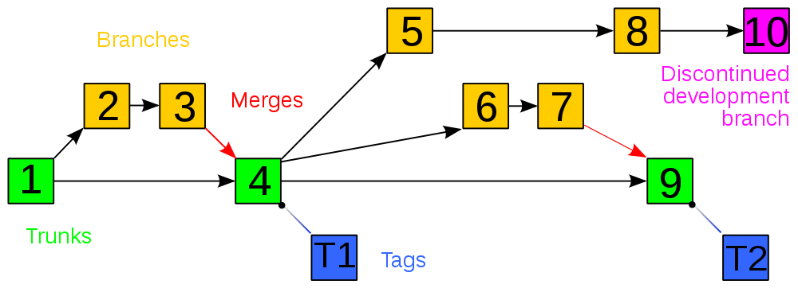

# CMEPPS Tarea Sesión 1

Inicie un proyecto y póngalo bajo control de versiones en Git. Realice las 12 operaciones de versionado que se reflejan en la imagen.

---

**Hecho por Fernando García-Palomo Albarrán**